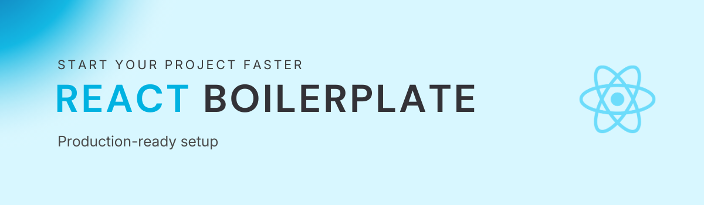

<div align="center">
  <br />
    
  <br />
  
  <div>
    
  </div>

  <h3 align="center">React Boilerplate</h3>

  <div align="center">
    Start building React apps, faster.
  </div>
</div>

## 📋 <a name="table">Table of Contents</a>

1. 🤖 [Introduction](#introduction)
2. ⚙️ [Tech Stack](#tech-stack)
3. ⚡ [Quick Start](#quick-start)
4. 🗂️ [Project Structure](#project-structure)

## <a name="introduction">🤖 Introduction</a>

This React Boilerplate provides a modern, production-ready foundation for building React applications efficiently and at scale.

It is designed to remove repetitive setup work by combining a fast build system, strict TypeScript configuration, modern routing, state management, data fetching, styling, and testing tools into a single, opinionated starting point.

The boilerplate focuses on clean architecture, clear separation of concerns, and developer experience. It can be used as a standalone frontend project or as the frontend layer of a full-stack application with any backend (REST, GraphQL, etc.).

Whether you are building a personal project, preparing for internships, or starting a production application, this boilerplate helps you move from idea to implementation quickly without sacrificing code quality.

## <a name="tech-stack">⚙️ Tech Stack</a>

### Frontend

- **Framework:** React
- **Build Tool:** Vite
- **Language:** TypeScript
- **Styling:** Tailwind CSS
- **Routing:** React Router
- **Data Fetching:** TanStack Query
- **State Management:** Zustand
- **Forms & Validation:** React Hook Form + Zod
- **Testing:** Vitest, Playwright
- **Linting & Formatting:** ESLint, Prettier

## <a name="quick-start">⚡ Quick Start</a>

### Prerequisites

Make sure you have the following installed:

- **Node.js:** v20 or v22 (LTS recommended)
- **npm:** v10 or later

You can check your versions with:

```bash
node -v
npm -v
```

---

### Installation

1. Create a new project using this template (recommended), or clone the repository:

```bash
git clone https://github.com/your-username/react-boilerplate.git
cd react-boilerplate
```

2. Install dependencies:

```bash
npm install
```

3. Start the development server:

```bash
npm run dev
```

4. Open your browser and navigate to:

```bash
http://localhost:5173
```

You should see the application running successfully.

---

### Running Tests

To run unit tests with Vitest:

```bash
npm test
```

## <a name="project-structure">🗂️ Project Structure</a>

```text
.
├── README.md              # Project documentation
├── assets/                   # Static assets for README (e.g. banners)
│   └── banner.png
├── eslint.config.js              # ESLint configuration
├── index.html                 # App HTML entry point
├── package.json               # Project metadata & dependencies
├── package-lock.json           # Dependency lock file
├── postcss.config.cjs           # PostCSS configuration
├── public/                   # Public static assets
│   └── vite.svg
├── src/                      # Application source code
│   ├── app/                  # App bootstrap & global providers
│   │   ├── App.tsx            # Root React component
│   │   ├── AppProviders.tsx    # Global providers (Query, Store, etc.)
│   │   ├── queryClient.ts       # React Query client setup
│   │   └── router.tsx          # Application routing
│   ├── components/            # Reusable UI components
│   ├── features/              # Feature-based modules
│   ├── hooks/                # Custom React hooks
│   ├── libs/                  # Shared utilities & helpers
│   ├── routes/                # Route-level pages
│   │   └── Home.tsx
│   ├── store/                # Global state management
│   │   └── useAppStore.ts     # Zustand store
│   ├── styles/               # Global styles & Tailwind entry
│   │   └── index.css
│   └── main.tsx              # App entry point
├── tailwind.config.ts            # Tailwind CSS configuration
├── tsconfig.json               # TypeScript base configuration
├── tsconfig.app.json            # TypeScript app-specific config
├── tsconfig.node.json           # TypeScript Node.js config
└── vite.config.ts               # Vite build configuration

```
